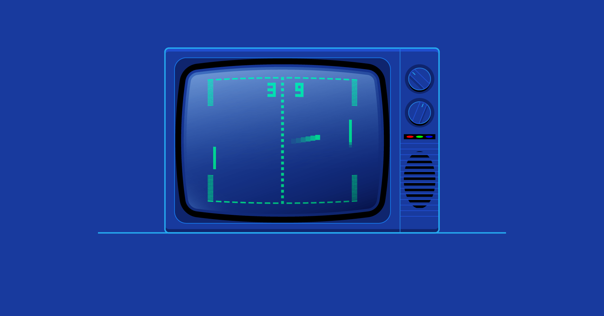

<h1 align="center" style="font-size: 150px">PongTime</h1>

<p align="center">

</p>

<p align="center">
	<b><i>Project developed at <a href="https://www.1337.ma/">1337 Khouribga </a> coding school.</i></b><br>
    <b><i>Authors: <a href="https://github.com/fathjami">@JamiaFathiya</a> & <a href="https://twitter.com/ashrafelkhnissi">@achrafelkhnissi</a> & <a href="https://github.com/zsarir23">@zsarir</a></i></b>
<!--
 <b><i>Grade: 125/100</i></b>
-->
</p>

<p align="center">
	
	
	
	
	
</p>

---

## Table of Contents

- [Table of Contents](#table-of-contents)
- [Introduction](#introduction)
- [Authors](#authors)
- [Technologies](#technologies)
- [Features](#features)
- [Usage](#usage)
- [Screenshots](#screenshots)

## Introduction

PongTime is a simple web application platform that allow users to play classic ping-pong with other users in real-time.

## Authors

- [Fathiya Olatokunbo Jamia](https://github.com/fathjami) - Frontend & Design
- [Achraf El Khnissi](https://twitter.com/ashrafelkhnissi) - Backend & DevOps
- [Zaineb Sarir](https://github.com/zsarir23) - Game (Frontend & Backend)

## Technologies

- Frontend: Next.js, Tailwind CSS
- Backend:
  - API: Nest.js
  - Real-time communication: Socket.io
  - Database: PostgreSQL
  - Authentication: Passport.js
  - 2FA: Twilio
  - Infrastructure: Docker, Docker Compose
- Game: Phaser.js, Matter.js

## Features

- [x] Real-time multiplayer game
- [x] User authentication
- [x] Friendship system
- [x] Notification system
- [x] Achievements
- [x] Search system
- [x] Two Factor Authentication (2FA)
- [x] Leaderboard
- [x] Private chat
- [x] Public chat rooms (public, private, protected with a password)
- [x] User profile (avatar, stats, achievements, friends, etc.)

## Usage

1. Clone the repository

```sh
git clone git@github.com:achrafelkhnissi/ft_transcendence.git
```

2. In the `.env.example` file at the root of the project, fill in the environment variables and rename the file to `.env` \

   Notes:

- Put your hostname or IP address in the `DOMAIN_NAME` variable
- In case of production build, set `NODE_ENV` to `production` and comment `backend` and `frontend` bind mounts volumes in `docker-compose.yml` file because those volumes are only needed for development because of hot-reloading.

3. Run the following command to start the project

```sh
make
```

4. Open your browser and go to `http://${DOMAIN_NAME}:${NEXT_PORT}` to access the application and `http://${DOMAIN_NAME}:${NEXT_PORT}/api` to access the API

- Change `${DOMAIN_NAME}` and `${NEXT_PORT}` with your environment variables set in the `.env` file

---

## Screenshots
